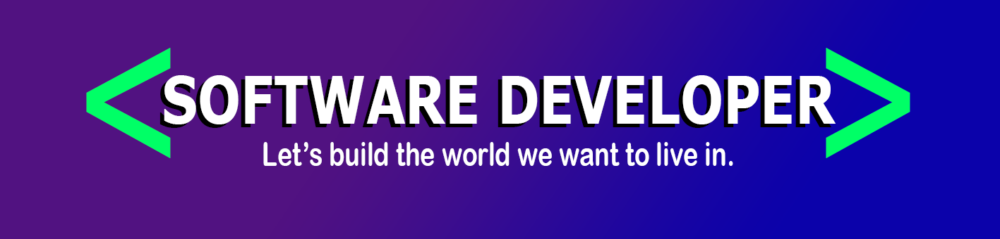

### Hi people 👋, I'm Gabit a software engineer

- I'm from Buenos Aires, Argentina 🧉
- I enjoy science, technology, 🎮, and 😺
- I'm currently working towards becoming a fullstack developer
- I’d like to have fun in IT and use technology to benefit people


## **MY SKILLS**

### Programming language

### Frontend

### Backend

### Testing

### Development tools

### CI/CD


```C
#include <stdio.h>

int main() {
  printf("Thanks for visiting.");
  return 0;
}
```

## **CONTACT**

<a style="margin-left: 20px;" href="http://gabit-portfolio.epizy.com/">
  
</a>

[](https://www.linkedin.com/in/jgvaleriano)
